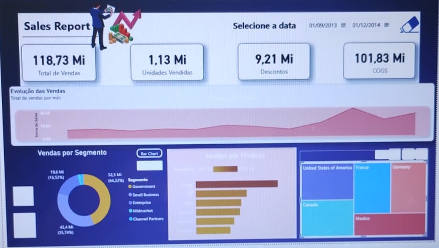
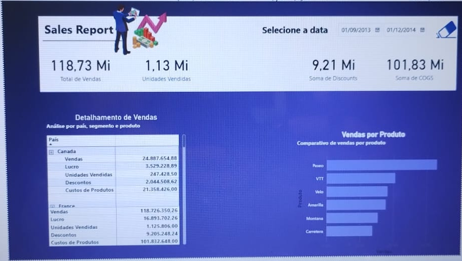

# Relatório Financeiro com Foco em Experiência do Usuário

Projeto desenvolvido por **Viviane Rambor** como parte de um desafio prático da **DIO**, com foco na melhoria da experiência do usuário em um relatório financeiro criado no **Microsoft Power BI**.

A proposta deste trabalho foi ir além da construção de gráficos. O objetivo principal foi reorganizar o relatório para tornar a navegação mais clara, a leitura mais intuitiva e a análise financeira mais agradável para quem utiliza o dashboard.

---

## Sobre o projeto

O relatório foi desenvolvido a partir de uma estrutura financeira já existente e passou por uma revisão completa de experiência do usuário.

Durante o desenvolvimento, foram trabalhados aspectos como:

- organização visual;
- hierarquia das informações;
- contraste e legibilidade;
- padronização dos indicadores;
- navegação entre páginas;
- uso de botões e indicadores;
- alternância entre diferentes tipos de gráficos;
- detalhamento das informações;
- organização dos elementos para facilitar a leitura;
- adaptação do projeto às funcionalidades disponíveis na versão do Power BI utilizada.

O resultado final foi organizado em três páginas principais:

1. **Home**
2. **Visão Geral**
3. **Detalhamento**

---

# Estrutura do relatório

## 1. Home

A página **Home** funciona como a porta de entrada do relatório.

Ela foi criada para oferecer uma apresentação visual simples e objetiva, conduzindo o usuário diretamente para a análise.

O botão **Explorar análise** permite navegar para a página **Visão Geral**.

### Principais características

- apresentação visual do projeto;
- identidade gráfica do relatório;
- botão de navegação;
- acesso rápido à análise financeira.

### Visualização


---

## 2. Visão Geral

A página **Visão Geral** concentra os principais indicadores e permite uma leitura rápida do desempenho financeiro.

Foram utilizados quatro indicadores principais:

- **Total de Vendas**
- **Unidades Vendidas**
- **Descontos**
- **COGS – Custo dos Produtos Vendidos**

Também foram organizadas visualizações para acompanhar a evolução das vendas e comparar os resultados sob diferentes perspectivas.

### Visualizações utilizadas

- Evolução das Vendas;
- Vendas por Segmento;
- Vendas por Produto;
- distribuição das vendas por país;
- Treemap por país.

Um dos recursos desenvolvidos foi a possibilidade de alternar a visualização de **Vendas por Segmento** entre:

- gráfico de barras;
- gráfico de rosca.

Essa interação foi configurada por meio de **botões e indicadores do Power BI**, permitindo que o usuário escolha a forma de visualização mais adequada.

### Visualização



---

## 3. Detalhamento

A página **Detalhamento** foi desenvolvida para permitir uma análise mais aprofundada das informações.

Foi criada uma matriz hierárquica utilizando:

**País → Segmento → Produto**

A matriz apresenta os seguintes indicadores:

- Vendas;
- Lucro;
- Unidades Vendidas;
- Descontos;
- Custo dos Produtos.

Os nomes dos campos foram ajustados para português diretamente nos visuais, sem alterar a estrutura original da base de dados.

Também foi criado um gráfico de **Vendas por Produto**, facilitando a comparação entre os diferentes produtos da base.

### Visualização



---

# Melhorias de experiência do usuário

Ao longo do projeto foram realizadas diversas melhorias com foco em usabilidade e leitura das informações.

Entre elas:

- reorganização dos elementos da página;
- padronização visual dos cards;
- melhoria de contraste;
- ajuste de tamanhos e proporções;
- definição de títulos e subtítulos;
- criação de navegação entre páginas;
- criação de botão de acesso na Home;
- uso de indicadores para alternância de gráficos;
- criação de matriz hierárquica;
- tradução dos campos exibidos nos visuais;
- melhoria da leitura dos rótulos;
- separação entre visão executiva e análise detalhada;
- revisão final da disposição dos gráficos.

---

# Navegação do relatório

A estrutura de navegação foi organizada da seguinte forma:

**Home → Visão Geral → Detalhamento**

Na página inicial, o botão **Explorar análise** conduz o usuário para a Visão Geral.

Na Visão Geral, os elementos interativos permitem explorar diferentes formas de visualização dos dados.

A página Detalhamento apresenta uma análise mais granular por país, segmento e produto.

---

# Decisão sobre o mapa

Durante o desenvolvimento, foi identificada uma limitação relacionada aos recursos de mapas disponíveis na versão do Power BI utilizada.

O visual de mapa inicialmente previsto não estava disponível para utilização e o recurso **Azure Maps** também não apareceu entre as opções disponíveis.

Para não comprometer o andamento do projeto, optei por manter o **Treemap por país**.

O Treemap permitiu preservar a análise da distribuição das vendas entre os países de forma simples e visualmente clara.

Essa situação também trouxe um aprendizado importante: em projetos reais, nem sempre todas as funcionalidades planejadas estarão disponíveis e, muitas vezes, será necessário adaptar a solução sem comprometer o objetivo da análise.

---

# Ferramentas utilizadas

- Microsoft Power BI Desktop
- GitHub
- Matrizes
- Gráficos de barras
- Gráfico de rosca
- Treemap
- Cards
- Segmentação de dados
- Botões
- Indicadores / Bookmarks
- Navegação entre páginas

---

# Organização do repositório

```text
power-bi-relatorio-financeiro-ux/
│
├── README.md
├── Sales_Report_UX_Final.pbix
│
└── imagens/
    ├── home_powerbi_crop.png
    ├── visao_geral_powerbi_crop.png
    └── detalhamento_powerbi_crop.png
```

---

# Como visualizar o projeto

Para abrir o relatório completo:

1. Baixe o arquivo `Sales_Report_UX_Final.pbix`;
2. Abra o arquivo no **Microsoft Power BI Desktop**;
3. Utilize a navegação pelas páginas:
   - Home;
   - Visão Geral;
   - Detalhamento;
4. Na página Visão Geral, utilize os botões de alternância para visualizar **Vendas por Segmento** em barras ou rosca;
5. Explore a matriz da página Detalhamento para navegar pelos níveis de país, segmento e produto.

---

# Principais aprendizados

Este projeto representou uma etapa importante no meu aprendizado em Power BI.

Durante o desenvolvimento, pude perceber que criar um bom relatório não significa apenas inserir gráficos em uma página.

Também é necessário pensar em:

- como o usuário encontra as informações;
- qual informação precisa aparecer primeiro;
- como facilitar a leitura dos indicadores;
- como organizar a navegação;
- como evitar excesso de elementos;
- como apresentar os dados de forma clara;
- como adaptar o projeto quando uma funcionalidade não está disponível.

Além da parte técnica, este desafio contribuiu para desenvolver uma visão mais prática sobre **experiência do usuário aplicada à análise de dados**.

Também foi uma oportunidade de aprender com os ajustes realizados durante o próprio processo de desenvolvimento, testando soluções, corrigindo configurações e buscando formas mais simples de apresentar as informações.

---

# Resultado final

O resultado foi um relatório financeiro organizado em três níveis de análise:

- uma página inicial de apresentação;
- uma visão executiva com os principais indicadores;
- uma página de detalhamento para análise mais aprofundada.

A proposta foi criar uma experiência mais clara e intuitiva, permitindo que o usuário compreenda rapidamente os principais números e, quando necessário, avance para análises mais detalhadas.

---

# Autoria

**Viviane Rambor**

Projeto desenvolvido como parte da formação prática em **Power BI da DIO**.

---

## Observação

Este projeto possui finalidade educacional e foi desenvolvido para prática e aperfeiçoamento de conhecimentos em **Power BI, visualização de dados e experiência do usuário**.
